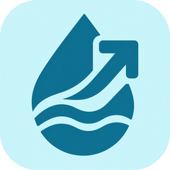
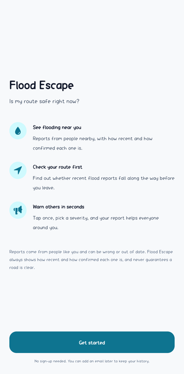
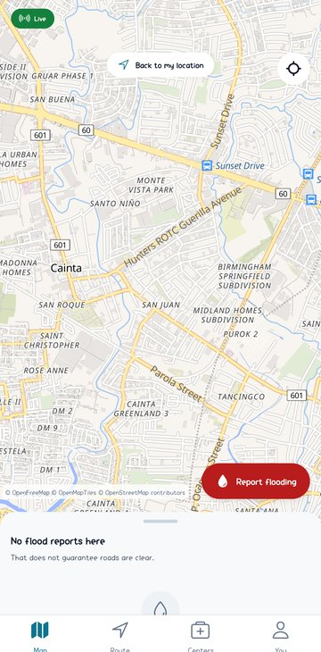
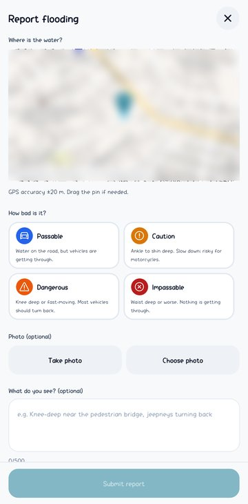
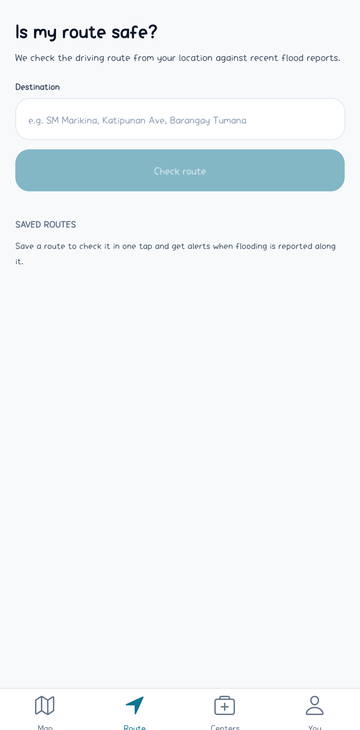
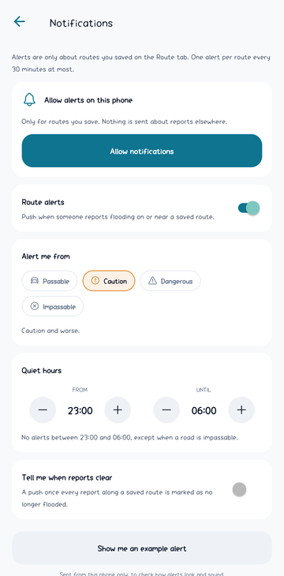
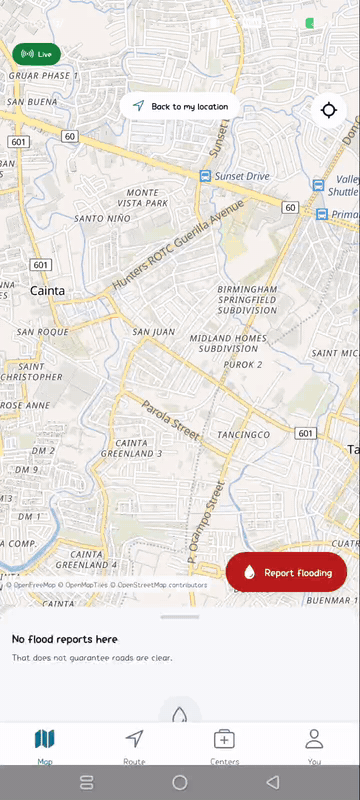

# Flood Escape

<p align="center">
  
</p>

<p align="center">
  <a href="https://github.com/wilfredo-domanico-jr/flood-escape-mobile-app/actions/workflows/ci.yml"></a>
</p>

A hyperlocal, crowdsourced flood-awareness and route-safety app for Metro Manila.

> People often discover that a road is flooded only after they have already reached it.

Flood Escape answers one question: **"Is my route safe right now?"** Users report flooding from their GPS position with a severity, an optional photo, and a note. Other users see nearby reports and confirm whether the water is still there. Every report carries its age and an explainable confidence score, the app keeps working offline, updates live, and warns users whose saved routes are affected.

Flood information is crowdsourced and treated as **untrusted**. The app never claims a road is safe, only that no recent reports were found.

## Screenshots

<table>
  <tr>
    <td align="center"><br><sub>Onboarding, no sign-up</sub></td>
    <td align="center"><br><sub>Live map, viewport-scoped reports</sub></td>
    <td align="center"><br><sub>Report in three taps</sub></td>
    <td align="center"><br><sub>Is my route safe?</sub></td>
    <td align="center"><br><sub>Saved-route alerts, quiet hours</sub></td>
  </tr>
</table>

Captured on a physical Android device (Infinix X6885, Android 15) from the development build. Map tiles by OpenFreeMap, data from OpenStreetMap contributors.

### Demo

<p align="center">
  
</p>

Map, the three-tap report form, and a live route check against recent reports. Recorded on the same device; the reporter's own location is blurred. An MP4 of the same clip is in [`docs/screenshots/demo.mp4`](docs/screenshots/demo.mp4).

## Try it

<table>
  <tr>
    <td>
      <b>Android APK, no store needed.</b><br><br>
      <a href="https://github.com/wilfredo-domanico-jr/flood-escape-mobile-app/releases/latest"><b>Download the latest preview build</b></a><br>
      <sub>About 150 MB. Android 8 or newer. Open the file on your phone and allow installation from this source when asked.</sub><br><br>
      Built in the cloud with EAS Build from the <code>preview</code> profile in <a href="eas.json">eas.json</a>, signed with the project's EAS-managed keystore.
    </td>
    <td align="center"><br><sub>Scan on your phone</sub></td>
  </tr>
</table>

## Status

Work in progress, built in phases. See [Roadmap](#roadmap).

| Phase | Scope | State |
|---|---|---|
| 1 | Foundation: Expo SDK 57, NativeWind, Supabase client, React Query, offline persistence, jest | Done |
| 2 | Anonymous auth with optional email upgrade, profiles table + RLS, onboarding | Done |
| 3 | Map with viewport-scoped reports, location handling, PostGIS read RPCs | Done |
| 4 | Fast reporting flow, SQLite outbox with idempotent retries, photo compression, storage policies, write RPCs with rate limits | Done |
| 5 | Report details with confidence explanation, activity, author close action | Done |
| 6 | Verification RPC with abuse rules, explainable confidence (SQL + TS mirror, 600-case fixture), lifecycle triggers and cron sweep | Done |
| 7 | Realtime updates scoped to viewport grid cells, focus/app-state lifecycle, cache patching | Done |
| 8 | Offline banner, client-side staleness for cached rows, Activity with retry/discard, Wi-Fi-only photos, location blur, delete my data | Done |
| 9 | Route safety: openrouteservice behind an Edge Function, buffered PostGIS route query, explainable risk levels, saved routes | Done |
| 10 | Evacuation centers, hospitals, fire and police with KNN nearest query, filters, directions deep links | Done |
| 11 | Push notifications (development build) | Done |
| 12 | Testing, performance, polish | Planned |

## Tech stack

| Layer | Choice |
|---|---|
| Mobile | React Native 0.86, Expo SDK 57, TypeScript 6, expo-router, NativeWind 4 |
| Server state | TanStack Query, persisted to SQLite for offline reads |
| Local state | zustand (viewport, connectivity, sync status) |
| Local DB | expo-sqlite (auth session storage, query cache, offline outbox) |
| Backend | Supabase: Postgres + PostGIS, Auth (anonymous first), Storage, Realtime, Edge Functions, RLS |
| Maps | MapLibre React Native with OpenFreeMap vector tiles (OpenStreetMap data, no API key) |
| Routing | openrouteservice behind a Supabase Edge Function (provider is swappable) |
| Tests | jest-expo, React Native Testing Library, pgTAP, Maestro |

## Architecture

```
Expo app
  src/app/         thin expo-router routes
  src/features/    screen logic per feature (map, reports, verification, routes, centers, offline)
  src/lib/         pure, testable logic: geo, confidence, lifecycle, validation, supabase client
  src/store/       zustand store
  src/db/          SQLite (query cache, offline outbox)
        │ supabase-js · Realtime · Storage · Edge Functions
Supabase
  Postgres + PostGIS   tables, SECURITY DEFINER RPCs for all writes, triggers, pg_cron sweeps
  Auth                 anonymous sign-in, optional email upgrade
  Storage              report photos (2 MB JPEG, EXIF stripped client-side)
  Realtime             flood_reports scoped by grid cell
  Edge Functions       route-safety (routing provider key), send-push
```

Business logic lives in two places only: Postgres functions (authoritative) and `src/lib` (pure TypeScript mirrors for offline display and unit tests). UI never computes trust on its own.

### Engineering themes

- **Geospatial queries** ([`reports_along_route`](supabase/migrations/20260904001400_routes.sql), [`routeRisk.ts`](src/lib/geo/routeRisk.ts)): PostGIS `geography` columns with GIST indexes; viewport-scoped and radius queries via `ST_DWithin`; route risk via a buffered `LineString` intersection.
- **Trust scoring** ([`compute_confidence`](supabase/migrations/20260904000600_confidence.sql), [`confidence.ts`](src/lib/confidence/confidence.ts), [shared fixture](src/lib/confidence/__fixtures__/compute_confidence.json)): an explainable, additive confidence formula (recency decay, independent confirmations, contradictions, photo evidence, damped reputation) implemented once in SQL and mirrored in TypeScript with shared fixtures.
- **Report lifecycle** ([`verify_lifecycle.sql`](supabase/migrations/20260904001000_verify_lifecycle.sql), [`lifecycle.ts`](src/lib/confidence/lifecycle.ts)): explicit states (active, stale, disputed, resolved) with severity-dependent staleness windows, driven by triggers and a cron sweep.
- **Offline-first** ([`outbox.ts`](src/features/offline/outbox.ts), [`drainOutbox.ts`](src/features/offline/drainOutbox.ts)): one write path through a SQLite outbox with idempotent `client_id` retries; cached reads with visible staleness.
- **Realtime** ([`cells.ts`](src/lib/geo/cells.ts), [`useReportsRealtime.ts`](src/features/map/useReportsRealtime.ts)): subscriptions scoped to grid cells covering the viewport, cleaned up on blur and background.
- **Privacy and security** ([`flood_reports.sql`](supabase/migrations/20260904000400_flood_reports.sql), [`compressPhoto.ts`](src/lib/media/compressPhoto.ts)): reporter identity split into a private table, RLS on every table, all mutations through rate-limited RPCs, EXIF stripped before upload.

## Getting started

Prerequisites: Node 20+, npm, Android Studio (SDK + JDK 17 or newer) or Xcode, a phone with USB debugging, a Supabase project (free tier is fine). The map library is native code, so the app runs as a development build rather than in Expo Go.

1. Install dependencies

   ```bash
   npm install
   ```

2. Configure Supabase

   ```bash
   cp .env.example .env
   # fill in EXPO_PUBLIC_SUPABASE_URL and EXPO_PUBLIC_SUPABASE_ANON_KEY
   npx supabase login
   npx supabase link --project-ref <your-project-ref>
   npm run db:push
   ```

   Enable **anonymous sign-ins** in the Supabase dashboard under Authentication.

3. Run the app

   ```bash
   npx expo run:android   # first time, or after adding native modules: builds and installs on the USB phone
   npx expo start          # afterwards: Metro only, open the installed Flood Escape app
   ```

   On Windows point `JAVA_HOME` at a JDK 17+ (Android Studio ships one under `jbr`) and `ANDROID_HOME` at the SDK before the first build.

## Push notifications

Alerts go out for saved routes only: a new report of caution or worse within the route buffer, an
impassable report reaching high confidence, and optionally "all clear". Rules (severity threshold,
quiet hours, one push per route per 30 minutes, never the author) live in SQL and are mirrored in
`src/lib/notifications/rules.ts` with tests on both sides. Delivery: a trigger fills
`notification_outbox`, pg_cron calls the `send-push` Edge Function every minute, and the function
talks to the Expo Push API and prunes dead tokens from receipts.

To receive pushes on Android you need Firebase Cloud Messaging once per project:

1. Create a Firebase project at https://console.firebase.google.com, add an Android app with the
   package name `com.wilfredodomanico.floodescape`, and download `google-services.json` into the repo
   root. It is gitignored; `app.config.js` picks it up automatically.
2. In Firebase, Project settings, Service accounts, generate a private key (JSON) and upload it with
   `npx eas-cli credentials` (Android, push notifications, FCM V1) so Expo's push service can deliver.
3. Rebuild the app: `npx expo run:android`.

Server side, set the shared secret the cron job uses (any random string) and store the same value
plus the function URL in Vault:

```bash
npx supabase secrets set PUSH_CRON_SECRET=<random>
npx supabase db query "select vault.create_secret('<random>', 'push_cron_secret'); select vault.create_secret('https://<project-ref>.supabase.co/functions/v1/send-push', 'push_function_url');"
```

## Testing what exists

See [docs/manual-testing.md](docs/manual-testing.md) for a phone walkthrough of every phase, and run `npm test` plus `npm run test:db` for the automated suites (unit, SQL/RLS, and the SQL-vs-TypeScript confidence fixture).

## Scripts

| Command | Purpose |
|---|---|
| `npm start` | Start the Expo dev server |
| `npm test` | Run unit tests (jest-expo) |
| `npm run typecheck` | `tsc --noEmit` |
| `npm run lint` | ESLint via `expo lint` |
| `npm run db:push` | Apply `supabase/migrations` to the linked project |
| `npm run db:reset` | Reset the local Supabase stack (requires Docker) |
| `npm run test:db` | Run pgTAP tests in `supabase/tests` against the local stack (requires Docker) |
| `npm run db:types` | Regenerate `src/lib/supabase/database.types.ts` from the local stack |

## Project structure

```
src/
  app/            routes (expo-router)
  components/ui/  shared UI primitives
  features/       feature modules
  lib/            pure logic and clients
  store/          zustand store
  constants/      theme tokens, thresholds
  db/             SQLite setup
supabase/
  migrations/     SQL migrations (extensions, schema, RPCs, RLS, cron)
  config.toml     local Supabase config
```

## Roadmap

1. Foundation
2. Authentication (anonymous first, optional email upgrade)
3. Map and location
4. Flood reporting through an offline outbox
5. Report details
6. Verification, confidence model, report lifecycle
7. Realtime updates
8. Offline read cache and sync polish
9. Route safety
10. Evacuation centers
11. Push notifications (EAS development build)
12. Testing, performance, polish

## Non-goals

Deliberately not built: flood prediction or forecasting, sensor integration, government dispatch, turn-by-turn navigation, social feed, chat, gamification, complex reputation systems, background location tracking, microservices.

## License

Copyright (c) 2026 Wilfredo Domanico. All rights reserved. Shared for demonstration and portfolio purposes only; see [LICENSE](LICENSE).
